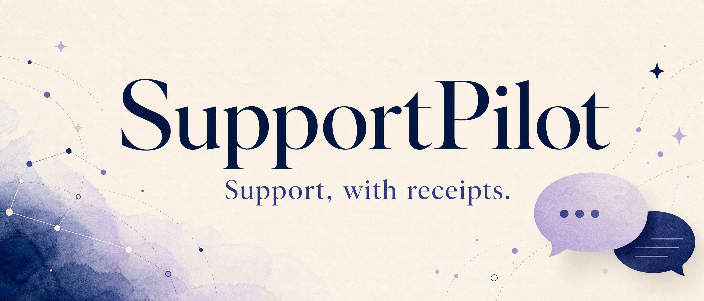
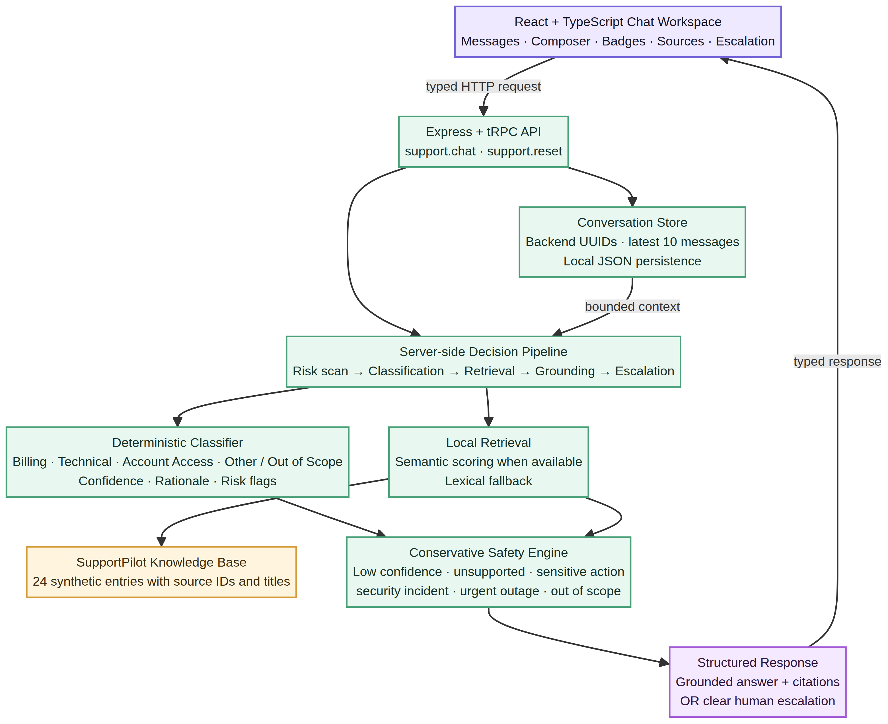

<div align="center">

# ✦ SupportPilot


### **Support, with receipts.**

A safe, grounded Tier-1 customer-support assistant that classifies requests, retrieves trusted guidance, cites its sources, and knows when a human should step in.

<br />


</div>

---


## 🚀 Live Demo !!

**Live Application:** [https://customer-support-ai-employee-triage.onrender.com](https://customer-support-ai-employee-triage.onrender.com/)

The application is deployed on Render and can be accessed directly through the link above.

> Click the link to try SupportPilot live — no setup required

## ✨ What is SupportPilot?

SupportPilot is a local-first support intelligence interface for routine customer questions. A message enters through a clean chat workspace, passes through server-side classification and retrieval, and returns a structured response with the detected category, heuristic confidence, grounded source citations, and escalation status.

The most important behavior is not simply answering. SupportPilot is designed to **decline safely** when the request is ambiguous, risky, sensitive, urgent, out of scope, or unsupported by the available knowledge base.

> **Core promise:** If SupportPilot cannot support an answer with evidence, it does not invent one.

## 🎯 What it can do

| Capability | What happens |
| --- | --- |
| **Intent classification** | Every request is assigned to Billing, Technical, Account Access, or Other / Out of Scope. |
| **Grounded retrieval** | Relevant synthetic SupportPilot guidance is ranked and returned with source IDs and titles. |
| **Safe answering** | Routine answers are generated from retrieved content and include citations. |
| **Human escalation** | Low-confidence, risky, sensitive, urgent, unsupported, and out-of-scope requests receive a visible review notice. |
| **Conversation continuity** | A backend-generated conversation ID keeps the latest ten messages available for short follow-ups. |
| **Local-first operation** | The project runs without paid AI APIs, production integrations, or external model services. |
| **Responsive experience** | The interface adapts from desktop workspaces to narrow screens. |

## 🧭 The request journey

```text
Message
  ↓
Risk scan + normalization
  ↓
Deterministic classification
  ↓
Knowledge-base retrieval
  ↓
Threshold and safety decision
  ↓
Grounded answer + citations OR human escalation
```

All business decisions happen on the server. The frontend is responsible for presentation, interaction, loading states, and accessibility; it does not calculate confidence, perform retrieval, decide safety, or call a language model directly.

## 🧱 Architecture

```text
┌───────────────────────────────────────────────┐
│ React + TypeScript chat workspace              │
│ - messages, composer, badges, sources          │
│ - loading, error, reset, escalation states     │
└──────────────────────┬────────────────────────┘
                       │ typed tRPC over HTTP
┌──────────────────────▼────────────────────────┐
│ Express + tRPC server                          │
│ - classification                               │
│ - retrieval                                    │
│ - grounding validation                         │
│ - threshold-based escalation                   │
│ - bounded conversation history                 │
└──────────────────────┬────────────────────────┘
                       │
┌──────────────────────▼────────────────────────┐
│ Local SupportPilot knowledge base              │
│ 24 synthetic FAQ entries                       │
│ Billing · Technical · Account Access · Other  │
└───────────────────────────────────────────────┘
```
## Architecture Diagram

### Technology choices

| Layer | Technology | Purpose |
| --- | --- | --- |
| Frontend | React 19, TypeScript, Vite | Fast, typed, responsive chat UI |
| Styling | Tailwind CSS 4 + custom CSS | Editorial visual system with responsive breakpoints |
| Server | Express 4, tRPC 11 | Typed API boundary and runtime server |
| Validation | Zod | Strict chat and reset inputs |
| Persistence | Local JSON conversation store | Lightweight bounded conversation persistence without external services |
| Retrieval | Local scoring with lexical fallback | Transparent ranking from synthetic support content |
| Testing | Vitest | Service and router behavior coverage |

## 🛡️ Safety model

SupportPilot uses conservative decision boundaries. A request can be classified and escalated at the same time; escalation never erases the classification result.

| Situation | Result |
| --- | --- |
| Confidence below `0.70` | Escalate for ambiguity |
| Best retrieval score below `0.45` | Escalate for insufficient evidence |
| No relevant source | Do not answer speculatively |
| Refund, deletion, payment change, or identity action | Escalate as a sensitive action |
| Suspected compromise, breach, or unauthorized access | Escalate as a security risk |
| Urgent outage or emergency language | Escalate for human review |
| Sales, legal, partnership, or unrelated questions | Escalate as out of scope |
| Answer fails source validation | Replace it with a safe escalation |

SupportPilot uses fictional support content only. It does not inspect or modify passwords, credentials, payment methods, account status, production systems, or platform token mechanisms.

## 📁 Project structure

```text
supportpilot/
├── client/
│   ├── index.html
│   └── src/
│       ├── pages/Home.tsx       # Main chat experience
│       ├── index.css            # Visual system and responsive layout
│       └── ...                  # Shared template components
├── server/
│   ├── supportpilot.ts          # Classification, retrieval, safety, chat flow
│   ├── routers.ts               # Typed support.chat and support.reset procedures
│   ├── supportpilot.test.ts     # Core behavior tests
│   └── support.router.test.ts   # API contract tests
├── SETUP_GITHUB_RENDER.md       # GitHub and Render deployment guide
├── todo.md                      # Implementation tracker
├── package.json
└── README.md
```

## 🚀 Run locally

### Requirements

Install Node.js 22.x, Git, and pnpm 10.x. Then open a terminal in the project directory.

```bash
pnpm install
pnpm dev
```

Open the local URL printed in the terminal, normally:

```text
http://localhost:3000/
```

No external AI service is required for the standard demo. OAuth is optional for the public chat experience. If OAuth is not configured locally, the chat remains available without login.

### Useful commands

```bash
# Start development mode
pnpm dev

# Type-check the project
pnpm check

# Run the test suite with a stable single worker
pnpm test -- --pool=forks --poolOptions.forks.singleFork

# Create the production bundle
pnpm build

# Run the production bundle locally
NODE_ENV=production pnpm start
```

## 💬 Try the demo

Use the following messages to see the main flows:

| Try this | Expected behavior |
| --- | --- |
| `How do I download an invoice?` | Billing classification, grounded response, source citation |
| `The API request is timing out` | Technical classification and technical source |
| `I cannot log in to my account` | Account Access classification |
| `Please refund and delete my account` | Sensitive-action escalation |
| `I think my account was hacked` | Security-risk escalation |
| `Tell me something` | Low-confidence or out-of-scope escalation |

Use **New conversation** to clear the active conversation. Follow-up messages reuse the same conversation ID and only the latest ten stored messages are retained.

## 🔌 API behavior

The frontend uses the typed tRPC procedures below:

```text
support.chat
Input:  { message: string, conversationId?: UUID }
Output: answer, conversationId, category, confidence, reason,
        riskFlags, sources, escalated, escalationReasonCode,
        escalationReasonMessage

support.reset
Input:  { conversationId: UUID }
Output: { success: true }
```

A successful response includes source metadata. An escalated response includes a machine-readable reason code and a human-readable explanation whenever the decision engine has enough information to identify the reason.

## 🧪 Quality checks

The repository includes focused tests for classification, retrieval scoring, sensitive-action and unclear-request escalation, grounding validation, conversation IDs, chat responses, and reset behavior.

Run the complete local verification sequence:

```bash
pnpm check
pnpm test -- --pool=forks --poolOptions.forks.singleFork
pnpm build
```

The expected result is **10 passing tests**, a successful TypeScript check, and a completed Vite/Express production build.

## 🌐 GitHub and Render

The complete publishing workflow is documented in [`SETUP_GITHUB_RENDER.md`](./SETUP_GITHUB_RENDER.md). The short version is:

```bash
git add .
git commit -m "Update SupportPilot"
git push origin main
```

For Render, create a **Node Web Service** connected to the GitHub repository with:

| Setting | Value |
| --- | --- |
| Build Command | `npm install -g pnpm@10.4.1 && pnpm install --frozen-lockfile && pnpm build` |
| Start Command | `pnpm start` |
| Node version | `22.13.0` |
| Health check path | `/` |

The Render build command intentionally installs pnpm through npm rather than calling `corepack enable`, avoiding a Corepack signature-verification issue that can occur before dependency installation begins.

## 🔐 Environment variables

The public local chat does not require OAuth. If authentication or scaffold integrations are enabled, configure values through your environment rather than committing secrets:

```dotenv
NODE_ENV=production
VITE_APP_TITLE=SupportPilot
JWT_SECRET=replace-with-a-long-random-secret
OAUTH_SERVER_URL=your-oauth-server-url
VITE_APP_ID=your-app-id
DATABASE_URL=your-managed-database-url
```

Never commit `.env`, private keys, production credentials, generated bundles, local logs, or conversation data. On Render, add secrets in the service’s **Environment** settings.

## ⚠️ Data and deployment note

The current conversation store is a lightweight local JSON file. It is intentionally simple and works well for a self-contained demonstration. A standard cloud container filesystem should be treated as disposable, so durable conversation history requires a managed database or an explicitly configured persistent disk.

## 🗺️ Practical next improvements

The codebase is intentionally easy to extend. Useful next steps include adding a real SQLite repository, replacing the local scoring switch with a true local embedding model, placing an optional Ollama adapter behind the existing safety boundary, and adding browser-level tests for loading, citation, escalation, and reset states.

---

<div align="center">

**SupportPilot** · grounded answers · visible boundaries · human-supervised support

</div>
